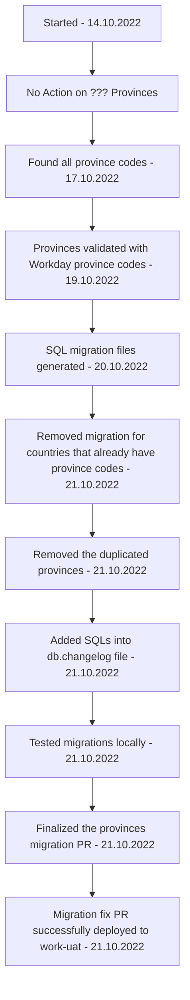

[[Accounting Service Post Release]]

## Tags:
#job 

## Links:
- [NG-28095](https://globalization-partners.atlassian.net/browse/NG-28095)
- [PR](https://github.com/globalization-partners/gp-go-global/pull/8663)
- [[Add Provinces Into Classic Learned]]

## Status


---

## Describe
- Update countries in [[Classic]] DB that have no provinces with provinces used in [[Workday]]

## Progress
- [x] Create countries JSON with alpha2 code and GP countryId
- [x] Find the ISO province codes
	- Using the [iso-3166-2](https://www.npmjs.com/package/iso-3166-2) npm package
	- For some provinces the ISO code was not found do to non eng. characters in the names
		- [x] Find the correct names for the these provinces
			- Added `name` property for real province name
			- Added code for provinces that are not available with [iso-3166-2](https://www.npmjs.com/package/iso-3166-2) package
- [x] Extract province codes from Workday
- [x] Compare Workday province codes with generated ones
- [x] Test SLQ structure for one province
- [x] Create a SQL that will be run by migration and will add missing [[Workday]] provinces
	- [X] Would need country code that missing provinces belong to
	- [X] Province code and name of the missing provinces
	- [X] Create migration file for each country
- [x] Remove migration files for countries that already have proince codes
	- Bahamas
	- Chile  
	- Cote d’Ivoire  
	- Egypt  
	- France  
	- Iceland  
	- Nicaragua  
	- Nigeria  
	- Peru  
	- South Africa  
	- Tanzania  
	- Ukraine  
	- United States  
	- Vietnam  
	- Zimbabwe
- [X] Moved migration files into release 55 folder

## Territories
- These territories are associated with existing countries
	- For now they will not be added to the associated countries
	- ``` 
		{ code3: '???', name: 'French Polynesia' }
		{ code3: '???', name: 'Guadeloupe' }
		{ code3: '???', name: 'Guam' }
		{ code3: '???', name: 'Macao' }
		{ code3: '???', name: 'Martinique' }
		{ code3: '???', name: 'Mayotte' }
		{ code3: '???', name: 'New Caledonia' }
		{ code3: '???', name: 'Northern Mariana Islands' }
		{ code3: '???', name: 'La Réunion' }
		{ code3: '???', name: 'Saint Barthelemy' }
		{ code3: '???', name: 'Svalbard' }
- Obsolete
	- No Əli Bayramlı (obsolete) for Azerbaijan
	- No Dəvəçi (obsolete) for Azerbaijan
	- No Xanlar (obsolete) for Azerbaijan
	- Bujumbura (obsolete) for Burundi
	- São Nicolau (obsolete) for Cape Verde
	- Calheta de São Miguel (obsolete) for Cape Verde
	- Nana-Grébizi (obsolete) for Central African Republic
	- Sangha-Mbaéré (obsolete) for Central African Republic
	- Borkou-Ennedi-Tibesti (obsolete) for Chad
	- Ādīs Ābeba (Addis Ababa) for Ethiopia
	- Ash Shāţi' (obsolete) for Libya
	- Yafran-Jādū (obsolete) for Libya
	- Mizdah (obsolete) for Libya
	- Ait Baha (obsolete) for Morocco
	- Ait Melloul (obsolete) for Morocco
	- Rabat Sale (obsolete) for Morocco
	- Comarca de San Blas (obsolete) for Panama
	- Al Ghuwariyah (obsolete) for Qatar
	- Jariyan al Batnah (obsolete) for Qatar
	- Al Jumaliyah (obsolete) for Qatar
	- Chişinău (obsolete) for Moldova, Republic of
	- Lăpuşna (obsolete) for Moldova, Republic of
	- Tighina (Bender) (obsolete) for Moldova, Republic of
	- Kaesong (obsolete) for North Korea
	- Nampho (obsolete) for North Korea
	- Agin-Buryat Autonomous Okrug (obsolete) for Russian Federation
	- Chita Oblast (obsolete) for Russian Federation
	- Ust'-Ordynskiy Buryatskiy (obsolete) for Russian Federation
- Can not match with Workday codes
	- IRQ-KI (Workday doesn't have this code)
	- SUR-SA (Workday doesn't have this code)

## Migration Issues
- Migration GitHub action failed
	- Caused by faulty migrations being included in `db.changelog`
	- PR approval GitHub action prevents any changes to added migrations files
		- So you can only add new files and replace files in the `db.changelog`
	- Failure was also caused by province names having `'` character
		- Escaping them proved to be tricky
		- Issue solved by using double quotation marks instead
- Recommended [[Classic#Migrations#Locally Run Migrations|testing migrations locally]] first before creating a PR