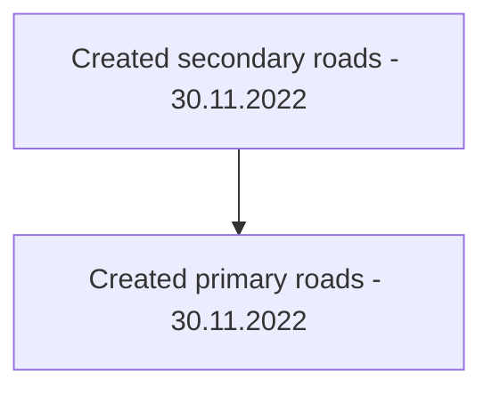

[[Project Split]]

## Tags:
#real-map #figma

## Links:
- [Figma](https://www.figma.com/file/pL5i4i46Clj6TS5NVFUJMn/Project-Split?node-id=0%3A1&t=A6D0Kq87ryy0g6fd-0)

## Status:

---

## Progress:
- [ ] Create current city road layout
	- Each of the category is a separate layer
	- [x] Create primary roads
	- [x] Create secondary roads
	- [ ] Create tertiary roads
	- [ ] Create railroads
	- [ ] Create city districts
		- Highlight:
			- [ ] Parks
			- [ ] Industrial areas
			- [ ] Airport
			- [ ] Pedestrian areas
			- [ ] Commercial districts
			- [ ] Campus
	- [ ] Highlight Services
		- [ ] Fire stations
		- [ ] Hospitals
		- [ ] Police stations
		- [ ] Mail offices
		- [ ] Road service building
		- [ ] Schools
		- [ ] 