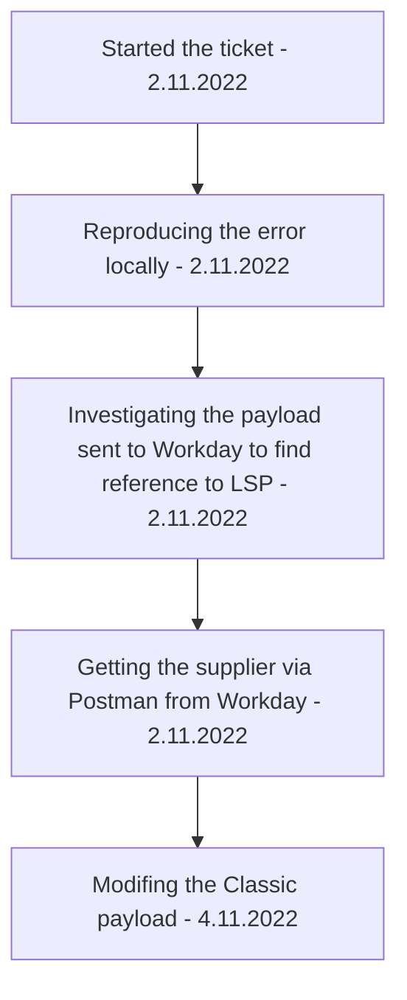

[[Accounting Service Post Release]]

## Tags:
#job #bugs #contractor

## Links:
- [NG-25506](https://globalization-partners.atlassian.net/browse/NG-25506)
- []

## Steps

---

## Description
- When the contractor changes the LSP from `GP Entity` to `Thirt party LSP` the change is not reflected in [[Workday]]

## Investigation
- Blindly, it sounds like some field in [[Workday]] payload is not used or set in such a way that allows the update of the related LSP
- Nathan confirmed that no LSP info is being sent to [[Workday]] via Contractor or Supplier
- Contractor is being represented and sent as a [[Project Intergration|Project]] in [[Workday]]
	- The LSP changes can be achieved if the `isGpEntity` flag is added to the [[Classic]] payload to [[Accounting Service]]
- When the contractor is updated is there a API call being sent to apply those changes to Workday?

## Progress
- [ ] Get Supplier or Contractor from [[Workday]] thought Postman
	- [x] Constructed the payload
		- The `Workday` Postman collection doesn't have the env variable for **password** and **username** for this endpoint
			- Trying to find the credentials (or references to them in the code)
			- `Username` found in `supplier.workday.service.ts`
				- [ ] **Make a Postman collection env variable for the username**
		- From the first viewing doesn't contain any references to the LSP
	- [x] Check the [[Workday]] documentation for the LSP references or fields
		- **Possible references**:
			- Restricted_To_Companies_Reference
			- CompanyObject
		- **Conclusion**
			- The LSP is not being sent via Contractor or Supplier
- [x] Find the class in [[Classic]] that handles sending create and update payloads to the [[Accounting Service]]
	- Contractor tab under the Client is hidden behind the `is.contractor.enabled` feature flag
	- Contractor tab frontend is in `contractor.jsp`
	- [Contractor Billing Architecture](https://globalization-partners.atlassian.net/wiki/spaces/GPB/pages/2801369164/Contractor+Billing+Overview)
	- Spotted some references to SNS  `application.properties`
		- `${environment}-eventing-middleware-contractor-topic`
	- [ ] Modify the payload to contain the `isGpEntity` flag
		- Since the GPP treats `Contractor` as `Professional` that field is send on the Contractor  creation
	- **The class that handles contractor creation is the same as for the Professionals**
- [ ] Is there an API call being sent when the contractor is created
	- **API call to update Contractor is not being made**
	- Since the Contractor is using `ContractorService` for updating the Contractor where the `AccountingService` class is not being called to update the contractor