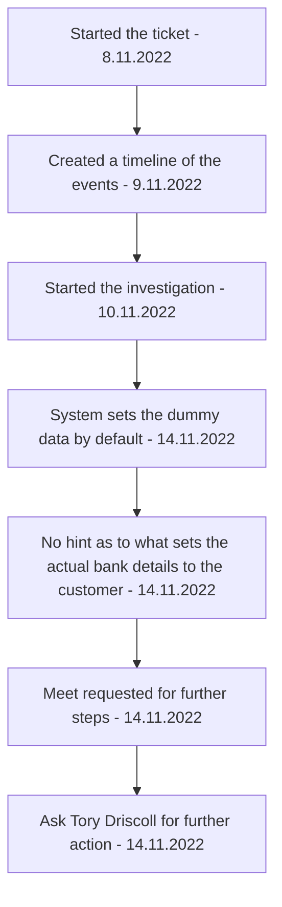

[[Accounting Service Post Release]]

## Tags:
#bugs #job #p1 #p2

## Links:
- [NG-29477](https://globalization-partners.atlassian.net/browse/NG-29477)

## Status

---

## Describe
- In [[Workday]] customer details are inactive
	- As seen in comment in the ticket
- Customer recently changed name but the bank details are the same in [[Classic]] and in approved state

## Assumptions
- Bank details haven't changed

## Timeline
![[image-20221104-125359.png]]

1) 10/25/2022 07:46
	- ISU-FINT001_GPP_Customer
		- Through [[Classic]]
	- Bank details are **inactive** with dummy details
2) 10/28/2022 01:32
	- ISU-FINT001_GPP_Customer
		- Through [[Classic]]
	- Bank details are **active** with Pending GPP and actual data
	- [NewRelic](https://one.newrelic.com/logger?account=1747307&begin=1666917000000&end=1666917300000&state=ca348201-6b03-5383-b482-13ebcf90958b)
3) 11/02/2022 01:49:36
	- User
		- Directly in [[Workday]]
	- **Inactive** with actual bank details
4) 11/02/2022 01:49:46
	- User
		- Directly in [[Workday]]
	- **Active** with actual bank details and Pending GPP
5) **11/02/2022 22:47**
	- ISU-FINT001_GPP_Customer
		- Through [[Classic]]
	- **Inactive** with Pending GPP and dummy bank details
	- [NewRelic](https://one.newrelic.com/logger?account=1747307&begin=1667428800000&end=1667429340000&state=548bdc6d-35b5-3668-c350-0c0d4d108576)
		- Payload doesn't have `clientTermCalendar` property
		- Payload has `campaignCode` property

## Investigation
- Why did the system set the customer data to dummy bank data, pending GPP and inactive
	- Why was the last request made
		- User made it through [[Classic]]
	- [x] Create a timeline of what happened with corresponding NewRelic links and descriptions of what happened
	- Code that sets the dummy bank data, Pending GPP and Inactive status is in `submit-customer.serializer.ts` in `_setDummyBankDetails` method
	- Data is in a state which suggests that **Bussiness entity update was not preformed** or didn't finish properly
		- However not errors were logged and the logs are in line with the instance 2)
		- This part of the code could definitely use more logging for visibility
	- Run a test to see how the code behaves when the `getBusinessEntityContactsEmailReferences` fails
	- In what appears to be the latest log from NewRelic, [[Classic]] sent the wrong address
		- It is not the last log, subsequent ones have the right address
- What request make the Client sets the actual bank details
	- Those requests are not visible in the logs (no logging on payloads or responses)
	- Will need to replicate this locally
		- [x] Construct the payload for PUT `accountingv2-service/clients/<client_id>`
			- Payload created for locally created test Client with accountingId: 000229
				- Constructed payload will be based on [[Client PUT prod payload]]
				- [[Client PUT Investigation Payload]]
		- After sending the payload, the client has dummy bank details
	- The only place in the codebase that sets `Bank_Account_Number` is in `submit-payment-methods-details.serializer`
		- `Bank_Account_Number` is one of the fields that have actual bank details value in [[Workday]]
		- [ ] Search for the `accountingv2-service/payment-methods` in the logs for the events referenced in the ticket
			- No such logs were found
				- No hint as to how the real bank details were set for the customer
- Requested a meet to determine what to do about this issue
	- Since a dead end has been reached and there is a potential that this is a one-off occurrencee
		- If this is a dead end then if the changes to [[Workday]] are permitted, then this would resolve the issue
			- The circumstance that goes in favour of this claim is the fact that the user has been renamed
				- Mishandling of this could be the cause of these issues
			- Missing `payment-method` call logs for this customer also give credence to the above claim
			- Also the last modification to the customer in [[Workday]] was done by system user
		- If this is a pressistant bug then further investigation is required that needs to yeald new hints
- [ ] Ask Tory Driscoll for further actions
	- 