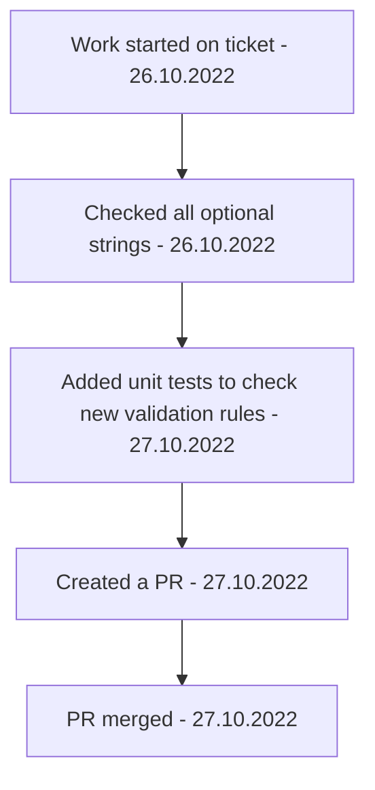

[[Accounting Service Post Release]]

## Tags:
#job #bugs 

## Links:
- [NG-24729](https://globalization-partners.atlassian.net/jira/software/c/projects/NG/boards/353?modal=detail&selectedIssue=NG-24729&assignee=61fc0df91c9bb000727d4544)

## Status:

---

## Description
- Some validations are failing when optional string receives empty string in AccountingClient
- Understand knock on impact of allowing empty string to bypass validation
	- Fix stuff that breaks as a result of that

## Test Calls With Empty String
- [x] clientProvince
- [x] paymentMethods.id
- [x] region
- [ ] industry
	- Workday throws and error
	- Also doesn't work with `null`
	- `SOAP-ENV:Client.validationError: Validation error occurred. Invalid ID value. '' is not a valid ID value for type = 'Customer_Category_ID' : SOAP-ENV:Client.validationError: Validation error occurred. Invalid ID value. '' is not a valid ID value for type = 'Customer_Category_ID'`
	- For now changed to `required` until we come to an agreement
- [x] oldPaymentMethod
- [x] businessEntityContactReference
- [x] businessEntityEmailsReferences
	- Managed to make array of empty string a valid value for this field