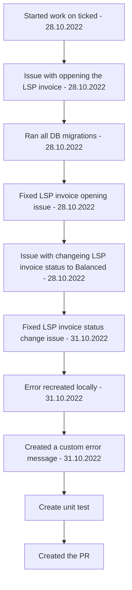

[[Accounting Service Post Release]]

## Tags:
#job 

## Links:
- [NG-26939](https://globalization-partners.atlassian.net/browse/NG-26939)
- [[Improve Error Message for Non Supported Transaction in LSP Invoice Learned]]

## Steps:

---

## Description
- Make a more descriptive and user friendly message

## Progress
- [x] Locally recreate the error
	- Different error message caused by the same root cause
- [x] Make a user friendly error message
- [x] Create a unit test
- [x] Create a PR

## Findings
- Error is recreated locally but with different error message
	- Instead of `An error has occurred during the call to Accounting Service. Message: Error converting JS to XML.”`
	- Received error message is `An error has occurred during the call to Accounting Service. Message: types_1.GPSpendCategoryToWorkSpendCategory[detail.billingTransactionApAccountingId] is not a function`
		- This behaviour was also seen on deployed env `work-uat`
		- Different error message could be caused by previous changes to the way spend categories are resolved
	- The underlying cause of the error seams to be the same: LSP invoice type is not supported or present in [[Accounting Service]]

## Issues/Problems
### Running DB migrations
- Some migrations are already performed but were not noted in DATABASECHANGELOG table
	- Comment out those migrations, so others can be executed
### Editing created LSP invoice
- Resolved by running all DB migrations
### Changing LSP invoice status
- Resolved by using another third party LSP