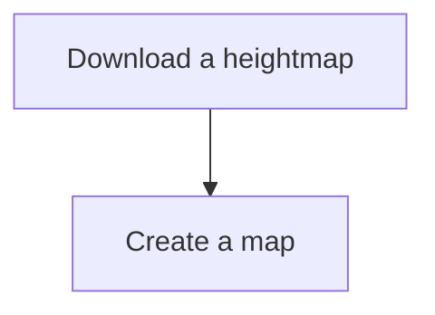

[[Cities Skylines]]

## Tags:
#gaming #real-map

## Links:
- [Real map tips](https://www.youtube.com/watch?v=cWJ7waoqWKo)

## Status:

---

## Tips:
- Overlay images on the map to create better terrain and Roads
	- For HD satellite images use Google earth PRO
	- [Image Overlay Mod](https://steamcommunity.com/sharedfiles/filedetails/?id=814102166)

## Developments References
- 

## Useful Mods and Assets
- [[Custom Landfil]]
- [[Wooden Powerpole]]

## Progress
