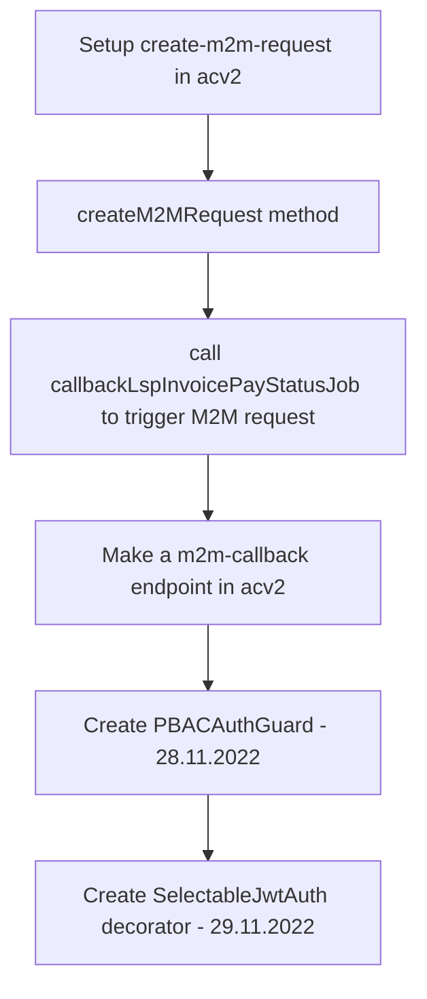
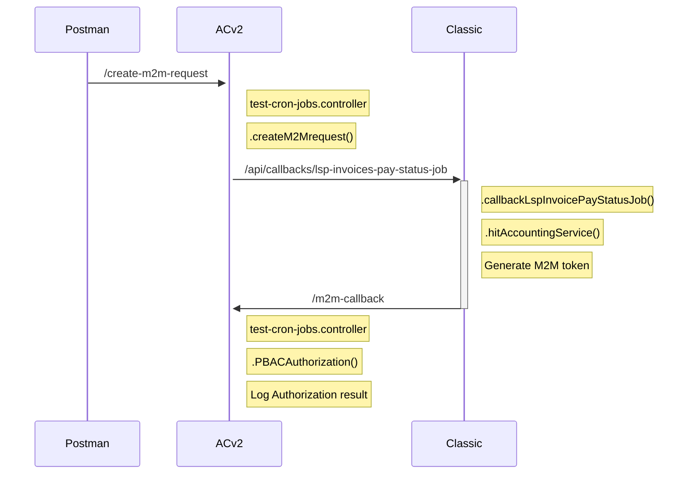

[[PBAC in ACV2]]

## Tags:
#job #intergration

## Links:

## Status:

---

## Progress:
- [ ] Setup authorization testing
	- Flow:
		- [x] Setup new `create-m2m-request` endpoint in [[Accounting Service]]
		- [x] Create `createM2MRequest` method in `cron-jobs.service.ts` to call [[Classic]]
		- [x] Modified `callbackLspInvoicePayStatusJob` to trigger M2M request
		- [x] Created `hitAccountingService` in `PricingServiceConnetor` to make a M2M request to [[Accounting Service]]
		- [x] Make a new callback endpoint in [[Accounting Service]]
		- [x] Create `PBACAuthGuard`
		- [x] Create `SelectablJwtAuth` decorator to select JWT auth policy for given endpoint

- [ ] Setup authorization of a request with M2M token, made by [[Accounting Service]]

## Issues
- [x] [[Classic]] can't retrieve the SSM params from AWS
	- `Error: User: arn:aws:iam::569806434804:user/svc-dev-ww1 is not authorized to perform: ssm:GetParameters on resource: arn:aws:ssm:us-east-1:569806434804:parameter/common/auth0/gp-localdev/app/gg-classic/username because no identity-based policy allows the ssm:GetParameters action (Service: AWSSimpleSystemsManagement; Status Code: 400; Error Code: AccessDeniedException; Request ID: 618795fe-eeca-4c9d-890a-7a853194d733; Proxy: null)`
		- Possible reason of this is because [[Classic]] is hitting local [[Localstack]] instead of [[AWS]]
	- Bypassed by hardcoding those values
- [x] [[Classic]] is forbidden to request tokens from `auth-service`
	- `com.gp.connector.pricing.PricingServiceConnector - org.springframework.web.reactive.function.client.WebClientResponseException$Forbidden: 403 Forbidden from POST http://127.0.0.1:8092/rbac-auth/v1/token/internal`
	- **auth-service**
		- `2022-11-23 14:12:21.918  WARN [authentication-service,2422735b4b39243b,2422735b4b39243b] 1 --- [nio-8092-exec-3] c.g.s.a.s.o.r.GrantRequestResolver       : Invalid client_id:K0VUT9ugnJMMnziOuN43snh0Ht4sp0G8`
	- Spoken to 2 guys that are code owners for the `auth-service`
		- Cause of the issue
			- Local [[Classic]] is using `auth-service` for authentication, which is a mock of a `auth0`
			- However, when trying to use `auth-service` for M2M token generation it is expecting experimental `client_id`
		- With this status the system is not ready to be used for local development
		- 2 guys are going to create a change to the `auth-service` to enable local development
	- **Solved** -> 2 code owners of `auth-service` made changes and merged them to main and updated the env variables
		- After the rebuild the issue disappeared
- [x] [[Classic]] gets 401 Unauthorized error code
	- No logs are shown in [[Accounting Service]] or `api-gateway`
	- [x] Try manually use the M2M token and hit [[Accounting Service]] with `Postman`
		- Same response as for [[Classic]]
			- The [[Classic]] was configured correctly, something else is the issue
		- `api-gateway` logs suggest that the user role couldn't be added to the request since we are not using the regular JWT token, but M2M one
		- **Solved**: Based on PBAC integration diagrams [[Accounting Service]] should be contacted directly, without going through `api-gateway`
	- Change the URI for hitting the [[Accounting Service]] from [[Classic]]
- [x] [[Accounting Service]] is throwing 401 when using M2M token
	- The PBAC guard is not even invoked
	- When the regular JWT is used PBAC guard is invoked
	- No logs are show in [[Accounting Service]]
	- [x] Who intercepts the request?
		- `api-gateway` intercepts the request since the used endpoint had `/api/v2/`
	- **Solution:** Hit the [[Accounting Service]] directly, bypassing `api-gateway`