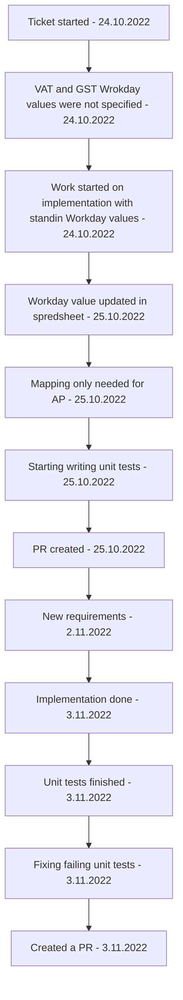

[[Accounting Service Post Release]]

## Tags:
#job #enhancment 

## Links:
- [NG-26370](https://globalization-partners.atlassian.net/jira/software/c/projects/NG/boards/353?modal=detail&selectedIssue=NG-26370)
- [Spread Sheet for mapping references](https://globalizationpartners.sharepoint.com/:x:/r/fs-pwc/_layouts/15/Doc.aspx?sourcedoc=%7BA82E1081-A304-40C1-82F1-6C6D613CB950%7D&file=GPP%20InventoryID%20-%20WD%20RevenueSpendCategory%20Mapping.xlsx&action=default&mobileredirect=true&cid=49aa9532-935a-4a92-b302-8d7db36ea218)

## Status:

---

## Description
- Need to add the ability to map one AP id to multiple Spend Categories
	-  Modified spend category object to be of type `Record<string, WorkdayCategoryResolver>`
	- `WorkdayCategoryResolver` is function that accepts Workday company code and returns spend category in a string format

## Progress
- New mapping requirements caused changes in Revenue Category
	- Changes are concentrated around AR id 21015
		- Returns different Revenue Category for Ireland and Singapore
		- Throws an error if any other country is used
- Failing unit tests
	- [x] `customer-invoice.workday.service.spec.ts`
		- [x] `handleInvoice › sendCustomerInvoice › should return customer invoice from POST`
		- [x] `handleInvoice › sendCreditMemo › should return customer invoice adjustment from POST`
	- [x] `submit-customer-invoice.serializer.spec.ts`
		- [x] `should return WorkdaySubmitCustomerInvoice`
		- [x] `should include VAT tax elements where applicable`
		- [x] `should include GST tax elements where applicable`
		- [x] `should not contain tax elements where not applicable`