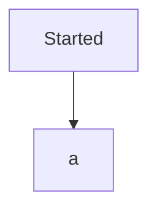

[[PBAC in ACV2]]

## Tags:
#job #intergration #security 

## [[PBAC in ACV2#Links:|Links]]:
- [Pricing Service](https://github.dev/globalization-partners/gp-pricing-service)

## Status:

---

## Progress:
- [ ] Create a dedicated service user and password
	- These should be stored in SSM
		- Currently there is only user
		- [ ] add user password to SSM
	- [ ] For the user creation in PBAC ask Hackoverflow to create it
		- Results from that store in SMM
- [ ] Add [GP Authentication Lib](https://github.com/globalization-partners/common-node-packages/blob/main/packages/authorization/README.md) to [[Accounting Service]]
	- **Question:** Do we get the `patternPolicyOptions` from the `gp-security-menagement-date` repo or do we create them in our service
		- Look what pricing did for M2M authentication
			- [x] Create way to authorize incoming requests similar to `isAuthorizedViaPBACPattern` method in [[#PBAC in ACV2 Links: Links :|Pricing Service]]
				- One caveat with this implementation is that the above mentioned method receives `APIGatewayProxyEvent`
	- [x] Createa a M2M guard that can be placed on specific endpoints similar to JwtAuthGuard
	- [x] Apply this guard to the endpoint
		- [[PBACAuthGuard Implementation Guide]]
	- [ ] Add PBAC policy to the `PBACAuthGuard`
	- [ ] Figure out a way to get the host value for local and deployed environments