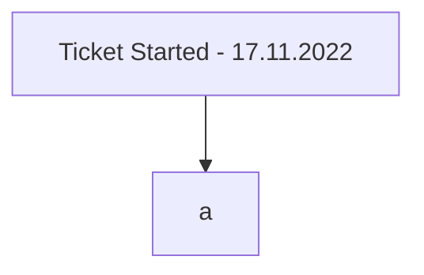

[[Contractor]]

## Tags:
#job #intergration #security 

## Links:
- [NG-30277](https://globalization-partners.atlassian.net/browse/NG-30277)
- [PBAC Integration Confluence](https://globalization-partners.atlassian.net/wiki/spaces/PBS/pages/2548990244/PBAC+integration+documentation)
- [[PBAC integration guide]]
- [PBAC Accounting User and Policy Request 12-10-2022](https://globalization-partners.atlassian.net/wiki/spaces/GPB/pages/2832433262/PBAC+-+Accounting+User+and+Policy+request+2022-10-12)
- [High Level Architecture](https://lucid.app/lucidchart/5a3b68bc-4109-487c-9437-627aecc03360/edit?invitationId=inv_aa78598d-b0dc-4568-b9b3-5b36a8e340eb&page=RgM-SRZu31MN#)
- [PBAC Governance and Operations](https://globalization-partners.atlassian.net/wiki/spaces/GPARCH/pages/2673868809/PBAC+Governance+and+Operations)

## Status:

---
## Instructions
- [[PBAC integration guide|General Integration Guide]]
- For getting PBAC policies in place contact **Maciej Dobecki**
- If the problems in integrations are encountered, contact pricing team since they already implemented PBAC into their service
	- The aformentioned guide is theirs
- For PBAC implementation
	- Name for service users
	- Policy to protect the resource
- Examples
	- [Role of User](https://github.com/globalization-partners/gp-security-management-data/blob/main/domains/time-expense/roles/gp.internal.service.te-person.general.json)
	- [Policy for User](https://github.com/globalization-partners/gp-security-management-data/blob/main/domains/user/security-policies/gp.user-service.person.app.json)
- Hackoverflow told pricing they can have a go at building their own definitions for their user or they can work together with them
	- Assume we can do the same

## Motivation
- Needed for pricing service to call [[Accounting Service]]
- Needed for new invoice service serverless stuff

## Description
- PBAC is needed for service to service communication
- Current service users and enpoints are protected by checking the service name
	- This change will have policies to protect the users and recources
- This ticket can be done as a 2 parter
	- In the first iteration create the ability for [[Accounting Service]] to authenticate the pricing service calls
	- In the second iteration create the ability for [[Accounting Service]] to send requests with M2M tokens

## Progress
- [x] Setup new Auth0 service for [[GP]]
- [ ] [[PBAC For Accepting Pricing Service Calls]]
- [ ] [[Locally Test PBAC Authorization]]
- [ ] Update design/architecture docs in lucid to reflect what is build
- [ ] Consider what observability needs to be in place
- [ ] Update runbook with details
- [ ] Add [GP Token Lib](https://github.com/globalization-partners/common-node-packages/tree/main/packages/token) to [[Accounting Service]]
	- Possible splitting into a different ticket
		- Not needed for completion of this ticket
	- [GP Token Lib Example](https://github.com/globalization-partners/gp-payroll-core/blob/0279c89e07dce179ef1a990dbae7e8d3fdfa31ef/src/utils/http/index.ts#L83)
	- Needs PBAC service username, should be in SSM under `/common/auth0/gp-development/app/SERVICE_ACCOUNT_USER/username`
	- Needs PBAC user-password, should  be in SSM under `/common/auth0/gp-development/app/SERVICE_ACCOUNT_USER/user-password`
	- Needs PBAC clientId in SSM under `/common/auth0/gp-development/app/internal-service/client-id`
- [ ] [[Locally Test PBAC Authorization]]
- [ ] Update design/architecture docs in lucid to reflect what is build
- [ ] Consider what observability needs to be in place
- [ ] Update runbook with details

## Questions
- [x] What would be a way of testing if the PBAC is working
	- Is it possible to test this locally → **YES, but some other app needs to running (part of the new authentication that Bulic talked about)**
	- Should this be tested in dev environments
- [ ] How does the `High Level Architecture` reflect on the production environments
- [x] What parts of the `High Level PBAC Architecture` are already created
	- This is only a suggested architecture, yet to be confirmed
		- Expect changes
	- Nothing is created