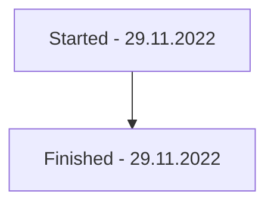

[[PBAC For Accepting Pricing Service Calls]]

## Tags:
#job #guidelines #intergration 

## Links:

## Status:

---
## Explanation
- Since the `JwtAuthGuard` and `PBACAuthGuard` are both performing validation of JWT tokens, their validations clash
	- `JwtAuthGuard` validates token that `api-gateway` added to the request and has encoded `userId` in it
	- `PBACAuthGuard` validates opaque JWT token derived from M2M token as part of PBAC M2M authentication flow

## Assumptions
- Controller the endpoint we wish to apply PBAC auth has `JwtAuthGuard` and `RolesGuard`

## Implementation steps
1) Remove the `@AllowedRules`
2) Set `requiresBearerAuth` to `false` from the `Swagger` options
3) Add `@SelectableJwtAuth` to be able to choose which JWT authentication policy will be applied to the endpoint
	- `JwtAuthPolicy` can be:
		- `BASE` which corresponds to the `JwtAuthGuard`
		- `PBAC` which corresponds to the `PBACAuthGuard`