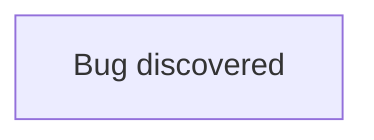

[[Accounting Service Post Release]]

## Tags:
#bugs

## Links:
- [Bug in Work uat](https://one.newrelic.com/logger?account=1747307&begin=1664628230221&end=1666788234530&state=9c2cbdf8-24bc-2839-4b53-2618d093d0a1)

## Status:

---
## Describe
- Create a bug ticket for `customerBusinessEntityContacts` RaaS failing 3 times
- `getBusinessEntityContactsReferencesRaas`  gets retried 3 times and fails
	- Because in `respShouldHaveReferenceId` property `Bill-To_Contacts_group` is being accessed but its is not returned in `customerBusinessEntityContacts` RaaS
- This behaviour is visible in the [deployed environment](https://one.newrelic.com/logger?account=1747307&begin=1664628230221&end=1666788234530&state=9c2cbdf8-24bc-2839-4b53-2618d093d0a1)
	- Probable reason why this was not raised is because of low frequency
		- Only 2 occurrences in the last 25 days