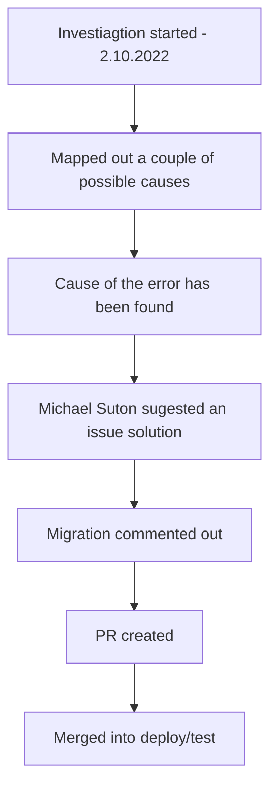

[[Accounting Service Post Release]]

## Tags:
#job #bugs 

## Links:
- [NG-29222](https://globalization-partners.atlassian.net/browse/NG-29222)

## Status

---

## Description
- Liquibase migration is failing
	- ![[Screenshot 2022-11-02 at 10.28.12.png]]

## Investigation
- Possible causes:
	1) The province may already exist in the database
		- Since the migration is using `INSERT` then if the item already exists in the DB there will an error
	2) The ID of the corresponding country doesn't exist
		- **CONFIRMED CAUSE**
		- Since the first SQL failed it could be that the `country_id` is incorrect or non-existent
			- This is supported by error description ``Reason: liquibase.exception.DatabaseException: Cannot add or update a child row: a foreign key constraint fails (`goglobal`.`province`, CONSTRAINT `FKipakwfceswwc0lb3esew9hqqv` FOREIGN KEY (`country_id`) REFERENCES `country` (`id`)) [Failed SQL: (1452) INSERT into province``
- Suggested solution is to comment out the migration file that is failing
	- For now this is the only one, but there could be more
	- ![[Screenshot 2022-11-02 at 11.13.37.png]]
	- It is questionable if this will cause the provinces to vanish from the prod that doesn't have this error
		- If the DB is in the different container from [[Classic]] the provinces should remain
		- Awaiting response from Michael Suton
			- **We are commenting out the faulty migration**