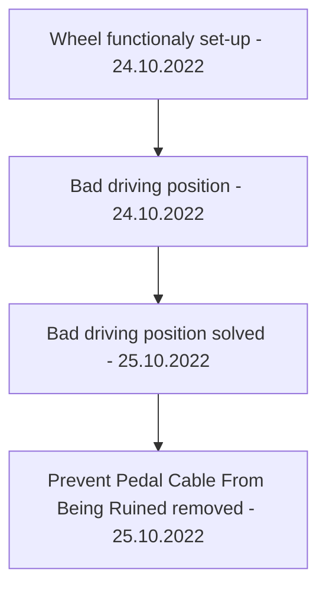

[[Logitech G29]]

## Tags:
#gaming_setup, #simracing, #setup

## Links:
- [Wheel Setup](https://coachdaveacademy.com/tutorials/how-to-set-up-your-logitech-g29-for-acc/)
---

1) Plugin power and pedals into wheel base
2) Download the [Driver](https://support.logi.com/hc/en-us/articles/360025298133)
3) Wheel configuration

## Room Setup

- ### Bad Driving Position (Solved)
	- **Problem:**
		- Results from to close position of the pedals to the wheel
			- Wheel is positioned over the pedals
				- Forces leaned forward driving position
					- After a while results in back strain
	- **Solution:**
		- Optimal Solution Requirements:
			- Easy wheel setup to the table
			- Minimal ware to the wheel connectors especial
				- Especially pedals to wheel connector
				- Minimal connection disconnection
					- Even when the wheel is stored in the box
			- Easy PC setup for driving position
		- Implemented solution:
			- [x] Easy wheel setup to the table
				- Easiest possible solution given the circumstances
					- Wheel needs to be out of Lovres reach → When not in use it's stored in the box
				- No wasted time connecting the cables
					- All cables are connected except the USB and power connection to the adapter
					- Power cable is always pluged in
			- [x] Minimal ware to the wheel connectors especial
				- [x] Especially pedals to wheel connector
				- [x] Minimal connection disconnection
					- [x] Even when the wheel is stored in the box
						- Wheel, pedals and adapter are stored in the box still connected
			- [x] Easy PC setup for driving position
				- Reworked cable management to make it easy to move the PC to make space for the pedals for better driving position
- ### Prevent Pedal Cable From Being Ruined (Removed)
	- Problem removed since the pedals are slanted, so the cable is not being bent by the wall when pushed up against it
	- Problem:
		- When the pedals are pushed to the wall the connecting cable is being overly bent which could cause fatigue of material over time
	- Solution:
		- Add something to create a buffer between pedals and lajsna
			- Buffer placements at the forward sides of the pedals
				- Allowes enough space for the cable

