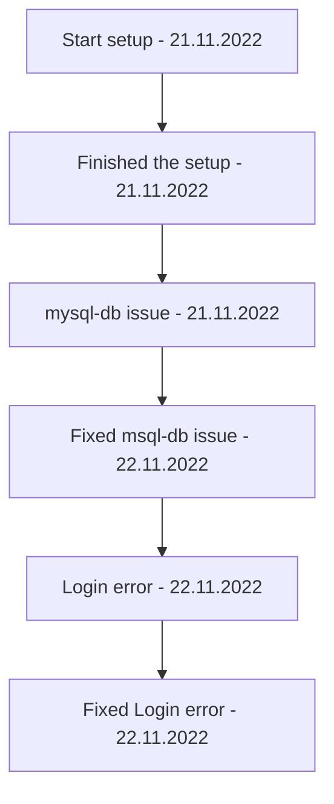

[[GP]]

## Tags:
#env #setup 

## Links:
- [Auth Setup Docs](https://github.com/globalization-partners/gp-auth-server)
- [Auth Flow Diagram](https://globalization-partners.atlassian.net/wiki/spaces/GPARCH/pages/2729247071/Auth+server+-+authentication+flow)
	- Machine to Machine flow is the relevant part
- 

## Status:

---

## Description
- Setup guides for the new authentication method used in [[GP]]
- **Motivation**
	- Password column in [[GP]] DB
- Auth-server is mocking auth0 for local development

## Progress:
- [x] Setup auth-server local domain
- [x] Clone gp-rbac-auth-service
- [x] Prepare environments
	- [x] Copy env variables to auth-service.env and legacy-goglobal.env from gp-dev-setup `main`
- [x] Enable auth0
- [x] Run services
- [x] Run GP application

## For M1 chip
- Copy env variables to auth-service.env and legacy-goglobal.env from gp-dev-setup `main` since `m1-fix` isn't updated

## Issues
- [x] Running [[Classic]] throws and error
	- `mysql-db: nodename nor servname provided, or not known`
	- Persists after using the latest code, migrations and env variables
		- In `application.properties` replaced `localhost` with `127.0.0.1`
			- In the `auth0` section copied all of the variables from the `main` branch of the `legacy-goglobal`
			- Set the `auth0.authentication.code.proxy.enabled` to **true**
	- **Solved** --> type `127.0.0.1:8080` into the browser to login
- [x] After logging into `auth-service` login
	- `127.0.0.1` page is not working because to many redirects occured
	- **Solved** --> Since I am using a local [[Classic]] in the `application.properties` `auth-service` host should be replaced with `127.0.0.1`