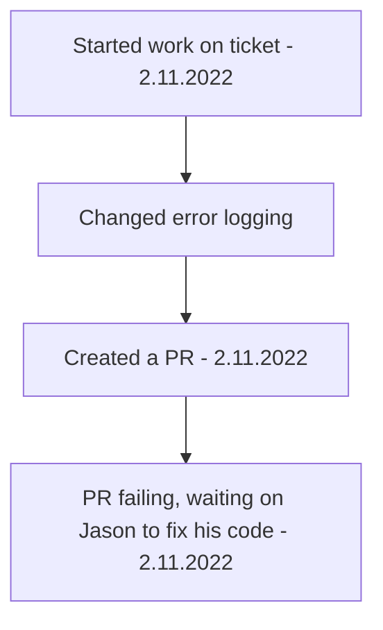

[[Accounting Service Post Release]]

## Tags:
#job #bugs 

## Links:
- [NG-29218](https://globalization-partners.atlassian.net/browse/NG-29218)

## Status:

--- 

## Description
- getProject call is rejected with 400 error code
	- This is logged and re-thrown as 500
	- The app interpreter checks the error code and logs it as JoiValidationError
- Make a better error message that is not misleading
## Progress
- Removed `JoiValidationError` from interpreter error log since it is used for logggin any errror
	- Replaced with `Error occurred`